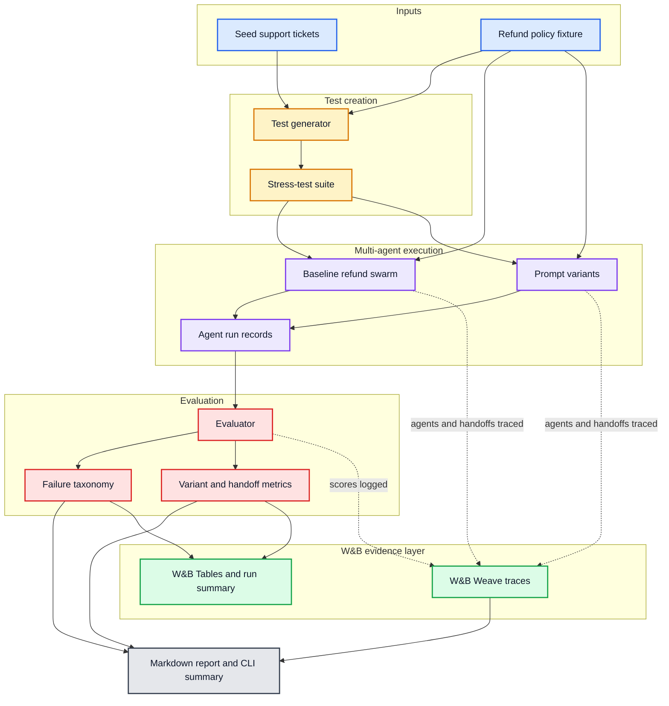

# Swarm Checkup

**A W&B-powered skill for testing, tracing, and improving multi-agent swarms.**

Agents are easy to demo and hard to trust. Swarm Checkup gives agent builders a repeatable QA loop: generate stress cases, run the same workload through a swarm, trace every handoff in W&B Weave, score the result, and compare prompt or model variants.

The repo includes both:

- a portable Claude/Codex skill at [`skills/swarm-checkup`](skills/swarm-checkup/)
- a demo refund-support swarm in [`refund_support_swarm`](refund_support_swarm/)

## Why It Exists

Most agent debugging is still too manual. When a swarm gives a bad answer, teams need to know whether the failure came from routing, retrieval, policy grounding, risk review, handoff state, the final response, or the judge.

Swarm Checkup makes those questions measurable:

- Did the swarm make the right decision?
- Did agents hand off the right state?
- Did a prompt change fix failures or create regressions?
- Can another teammate inspect the exact trace and result table?

## What The Demo Does

The bundled demo runs a deliberately flawed customer-support refund swarm against hard refund tickets, then compares it with improved prompt variants.

It tracks:

- coordinator, triage, policy, risk, decision, response, and judge agents
- explicit inter-agent handoffs and shared-state access
- policy correctness, decision correctness, completeness, tone, and injection resistance
- coordination health, handoff count, latency, fixed cases, regressions, and top failure category
- W&B Weave traces and W&B Tables when online logging is enabled

The current default LLM is `Qwen/Qwen3.5-35B-A3B` through W&B Inference.

## Demo Flow



## Quick Start

```bash
python3 -m venv .venv
.venv/bin/pip install -e ".[dev]"
export WANDB_API_KEY=...
.venv/bin/python scripts/run_agent_qa.py --cases 1 --wandb-mode disabled
```

`--wandb-mode disabled` turns off W&B run logging, but agents still call W&B Inference. Keep `WANDB_API_KEY` set.

For a fuller run:

```bash
.venv/bin/python scripts/run_agent_qa.py --cases 24
```

The command writes [`docs/swarm-checkup-report.md`](docs/swarm-checkup-report.md).
See [`docs/skill-output-example.md`](docs/skill-output-example.md) for a sample skill run and report summary.

## Run The Skill

Install the local skill:

```bash
python3 scripts/install_skill.py
```

Run it with Codex:

```bash
codex exec -C . "Use swarm-checkup skill for swarm refund_support_swarm. Run 1 case. Run W&B disabled."
```

Or call the skill script directly:

```bash
python3 skills/swarm-checkup/scripts/run_agent_qa.py --agent-path refund_support_swarm --cases 24
```

For another swarm repo, point `--agent-path` at the swarm package or provide an explicit eval command. The skill looks for common `run_agent_qa`, `run_swarm_qa`, and `eval_swarm` commands and includes handoff metrics when the harness emits them.

## W&B Configuration

The default project is `swarm-checkup`.

```bash
WANDB_API_KEY=...
WANDB_ENTITY=...
AGENT_QA_WANDB_PROJECT=swarm-checkup
AGENT_QA_DEMO_MODEL=Qwen/Qwen3.5-35B-A3B
WANDB_INFERENCE_BASE_URL=https://api.inference.wandb.ai/v1
WANDB_INFERENCE_TIMEOUT_SECONDS=20
WANDB_INFERENCE_MAX_RETRIES=0
```

W&B mode defaults to `auto`: online logging is used when `WANDB_API_KEY` is available, otherwise run logging is disabled. W&B Inference-backed agent calls always require `WANDB_API_KEY`.

## Outputs

- [`docs/swarm-checkup-report.md`](docs/swarm-checkup-report.md): generated reliability report
- [`docs/skill-output-example.md`](docs/skill-output-example.md): example skill console output
- [`docs/swarm-checkup-summary.md`](docs/swarm-checkup-summary.md): short project summary
- [`docs/how-it-works.md`](docs/how-it-works.md): implementation walkthrough
- [`docs/swarm-checkup-prd.md`](docs/swarm-checkup-prd.md): product requirements
- [`docs/swarm-checkup-presentation.html`](docs/swarm-checkup-presentation.html): five-slide presentation deck
- [`docs/swarm-checkup-slide-deck.md`](docs/swarm-checkup-slide-deck.md): markdown deck outline

## Repository Map

- [`refund_support_swarm/`](refund_support_swarm/): demo swarm package
- [`refund_support_swarm/swarm_agents/`](refund_support_swarm/swarm_agents/): separate swarm agent modules
- [`skills/swarm-checkup/SKILL.md`](skills/swarm-checkup/SKILL.md): portable skill instructions
- [`skills/swarm-checkup/scripts/run_agent_qa.py`](skills/swarm-checkup/scripts/run_agent_qa.py): skill runner
- [`data/refund_policy.md`](data/refund_policy.md): refund policy fixture
- [`data/fallback_tests.json`](data/fallback_tests.json): stable demo test suite
- [`scripts/run_agent_qa.py`](scripts/run_agent_qa.py): repo CLI wrapper

## Hackathon Pitch

**Title:** Swarm Checkup

**Tagline:** A W&B-powered skill that turns multi-agent swarms into tested, traced, improvable systems.

**One-line pitch:** Most teams built agents. Swarm Checkup builds the lab that makes agents reliable.
