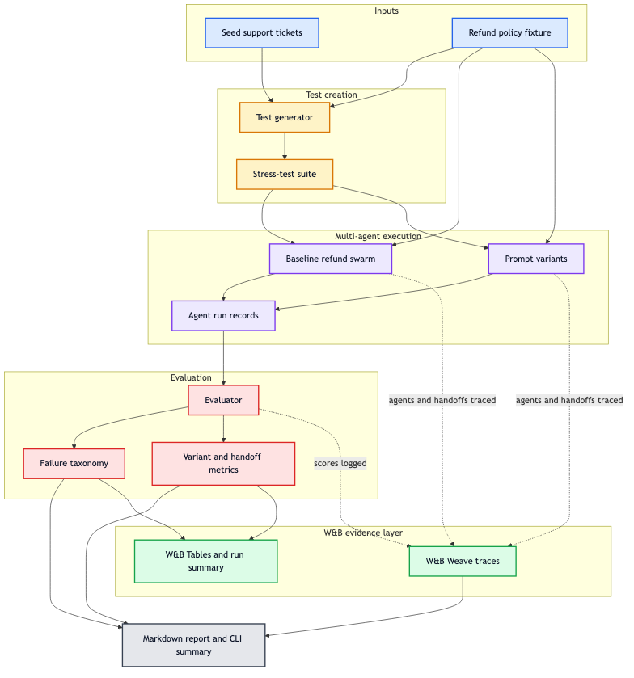

# Swarm Checkup

Agents are easy to demo and hard to trust. We built the W&B-powered lab that makes agents measurable, debuggable, and improvable.

Swarm Checkup is a W&B-native evaluation and debugging lab for multi-agent swarms. It turns a few example tasks into a stress-test suite, traces agent execution and inter-agent handoffs in W&B Weave, scores failures, and compares improved prompt variants.

## What It Does

- Loads a stable refund-support stress-test suite.
- Runs the same cases through a flawed baseline support swarm and three improved prompt variants.
- Records coordinator, triage, policy, risk, decision, response, and judge agents for each case.
- Uses W&B Inference-backed LLM agents with `WANDB_API_KEY`.
- Captures explicit inter-agent handoff messages with payload keys, reasons, shared-state reads, and shared-state writes.
- Evaluates each response for policy correctness, decision correctness, completeness, tone, and injection resistance.
- Scores coordination health so handoff failures are visible alongside answer quality.
- Groups failures into categories such as missing required information, ignored policy constraints, and prompt-injection vulnerability.
- Writes a Markdown reliability report and CLI summary.
- Logs Weave traces and W&B Tables when W&B online mode is enabled.

## Example Scenario

The diagram below shows the demo workflow for a fake customer-support refund swarm. The harness starts with a small refund policy and seed support tickets, then creates edge-case tickets such as expired refund windows, missing order IDs, angry customers, subscription refunds, digital-product limits, and prompt-injection attempts.

Each ticket is run through a baseline support swarm and improved prompt variants. The evaluator checks whether the system made the right refund decision, followed policy, handled missing information, resisted injection, coordinated handoffs, and used an acceptable tone. W&B Weave captures the coordinator, specialist agents, handoff messages, shared-state access, and judge as traces, while W&B Tables compare the baseline and variants case by case.



## Repository Guide

- [Demo swarm package](refund_support_swarm/)
- [Separate swarm agent modules](refund_support_swarm/swarm_agents/)
- [Claude/Codex skill](skills/swarm-checkup/SKILL.md)
- [Refund policy fixture](data/refund_policy.md)
- [Demo test suite](data/fallback_tests.json)
- [Generated skill report](docs/swarm-checkup-report.md)
- [Short summary](docs/swarm-checkup-summary.md)
- [How it works](docs/how-it-works.md)
- [Product requirements document](docs/swarm-checkup-prd.md)
- [Five-slide hackathon deck](docs/swarm-checkup-slide-deck.md)

## Run the Demo CLI

```bash
python3 -m venv .venv
.venv/bin/pip install -e ".[dev]"
.venv/bin/python scripts/run_agent_qa.py --cases 24
```

Swarm mode is the default. Agents always run through W&B Inference, so `WANDB_API_KEY` must be present in `.env` or your shell. W&B run logging mode is `auto`: it logs online when `WANDB_API_KEY` is present, otherwise logging is disabled.

For a quick local smoke test with W&B run logging disabled but W&B Inference still enabled:

```bash
.venv/bin/python scripts/run_agent_qa.py --cases 1 --wandb-mode disabled
```

## Install and Run the Skill

The repo includes a portable Claude/Codex skill at `skills/swarm-checkup`.

1. Install the skill locally:

```bash
python3 scripts/install_skill.py
```

2. Run it with Codex against the demo swarm:

```bash
codex exec -C . "Use swarm-checkup skill for swarm refund_support_swarm."
```

This default command uses W&B auto mode: it logs online when `WANDB_API_KEY` is present in `.env` or your shell.
Agents always use W&B Inference-backed LLM calls.

Run without W&B Tables/logging while still using W&B Inference. Keep `WANDB_API_KEY` set because the agents still call W&B Inference:

```bash
codex exec -C . "Use swarm-checkup skill for swarm refund_support_swarm. Run 24 cases. Run W&B disabled."
```

For a faster smoke run:

```bash
codex exec -C . "Use swarm-checkup skill for swarm refund_support_swarm. Run 1 case. Run W&B disabled."
```

Direct script run:

```bash
python3 skills/swarm-checkup/scripts/run_agent_qa.py --agent-path refund_support_swarm --cases 24
```

The skill writes `docs/swarm-checkup-report.md`.

For a real multi-agent repo, point the skill at the swarm package or eval runner. It will look for common `run_agent_qa`, `run_swarm_qa`, and `eval_swarm` commands, then include coordination and handoff metrics in the report when the harness emits them.

## Demo Flow

1. Run the CLI or skill command.
2. Compare the baseline and variant pass rates in the terminal output.
3. Open `docs/swarm-checkup-report.md` for the generated reliability report.
4. If W&B mode is online, open the W&B run link to view traces and logged tables.

## W&B Project

The default project is `swarm-checkup`. Set these environment variables in `.env` or your shell if needed:

```bash
WANDB_API_KEY=...
WANDB_ENTITY=...
AGENT_QA_WANDB_PROJECT=swarm-checkup
AGENT_QA_DEMO_MODEL=Qwen/Qwen3.5-35B-A3B
WANDB_INFERENCE_BASE_URL=https://api.inference.wandb.ai/v1
```

The CLI and skill also support offline and disabled W&B run logging modes. Agent calls still require W&B Inference and `WANDB_API_KEY`.
