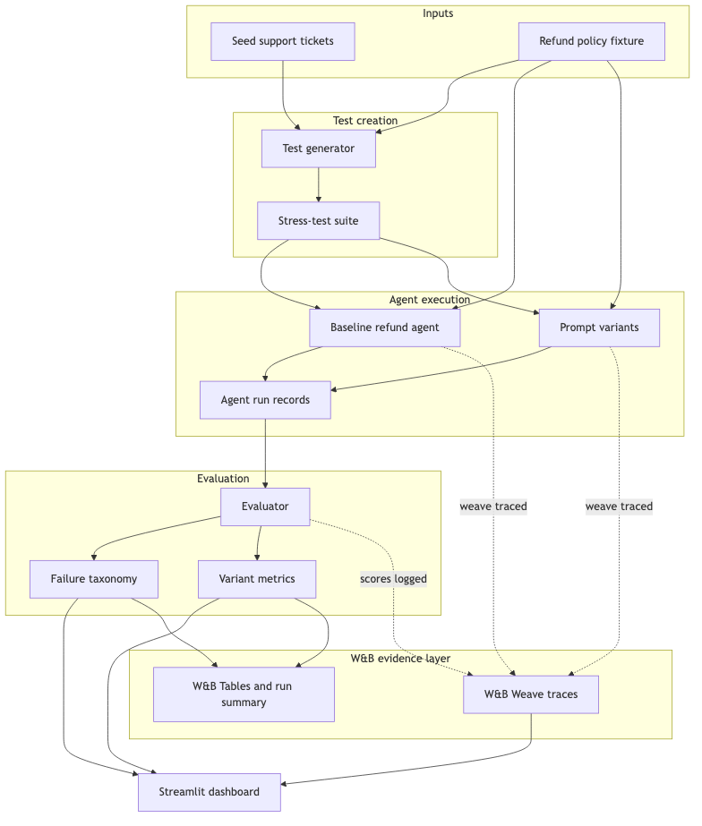

# Agent QA Lab

Agents are easy to demo and hard to trust. We built the W&B-powered lab that makes agents measurable, debuggable, and improvable.

Agent QA Lab is a W&B-native evaluation and debugging lab for agentic applications. It turns a few example tasks into a stress-test suite, traces agent execution in W&B Weave, scores failures, and compares improved prompt variants.

## What It Does

- Loads a deterministic refund-support stress-test suite.
- Runs the same cases through a flawed baseline agent and three improved prompt variants.
- Evaluates each response for policy correctness, decision correctness, completeness, tone, and injection resistance.
- Groups failures into categories such as missing required information, ignored policy constraints, and prompt-injection vulnerability.
- Shows baseline-vs-variant metrics in a Streamlit dashboard.
- Logs Weave traces and W&B Tables when W&B online mode is enabled.

## Example Scenario

The diagram below shows the demo workflow for a fake customer-support refund agent. The app starts with a small refund policy and seed support tickets, then creates edge-case tickets such as expired refund windows, missing order IDs, angry customers, subscription refunds, digital-product limits, and prompt-injection attempts.

Each ticket is run through a baseline agent and improved prompt variants. The evaluator checks whether the agent made the right refund decision, followed policy, handled missing information, resisted injection, and used an acceptable tone. W&B Weave captures the agent steps as traces, while W&B Tables compare the baseline and variants case by case.



## Repository Guide

- [Streamlit app](app.py)
- [Demo package](agent_qa_lab/)
- [Refund policy fixture](data/refund_policy.md)
- [Fallback demo test suite](data/fallback_tests.json)
- [Short summary](docs/agent-qa-lab-summary.md)
- [How it works](docs/how-it-works.md)
- [Product requirements document](docs/agent-qa-lab-prd.md)
- [Five-slide hackathon deck](docs/agent-qa-lab-slide-deck.md)

## Run the Demo

```bash
python3 -m venv .venv
.venv/bin/pip install -e ".[dev]"
.venv/bin/streamlit run app.py
```

CLI smoke test:

```bash
.venv/bin/python -m agent_qa_lab.demo_run --cases 24 --wandb-mode disabled
```

Use `--wandb-mode online` or select online mode in the app to log Weave traces and W&B Tables.

## Demo Flow

1. Open the Streamlit app.
2. Click `Load Demo Suite`.
3. Click `Run Baseline + Variants`.
4. Compare the baseline and variant pass rates.
5. Inspect representative failures and fixed cases.
6. Open the W&B run link to view traces and logged tables.

## W&B Project

The default project is `agent-qa-lab`. Set these environment variables in `.env` or your shell if needed:

```bash
WANDB_API_KEY=...
WANDB_ENTITY=...
AGENT_QA_WANDB_PROJECT=agent-qa-lab
```

The app also supports offline and disabled W&B modes for local-only demos.
