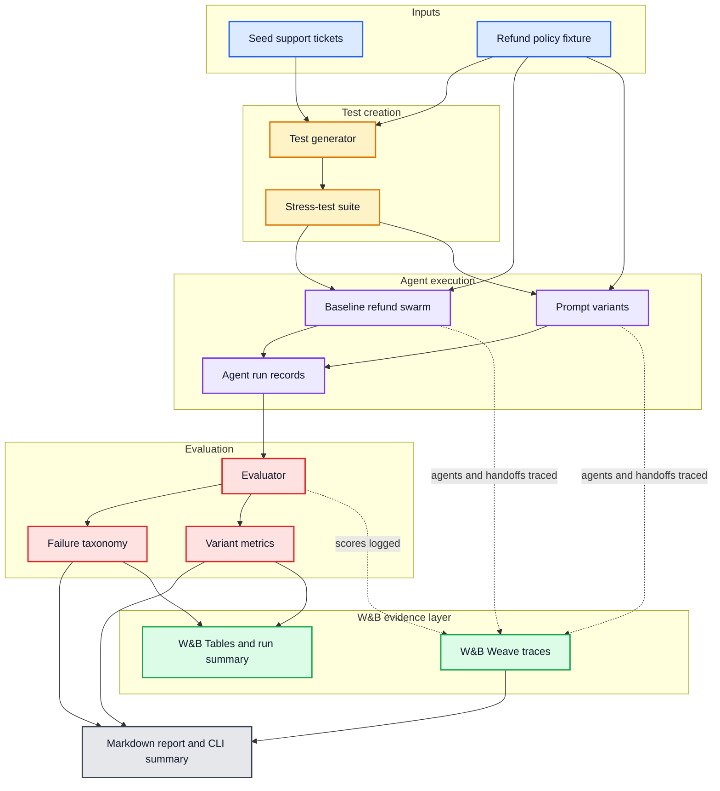
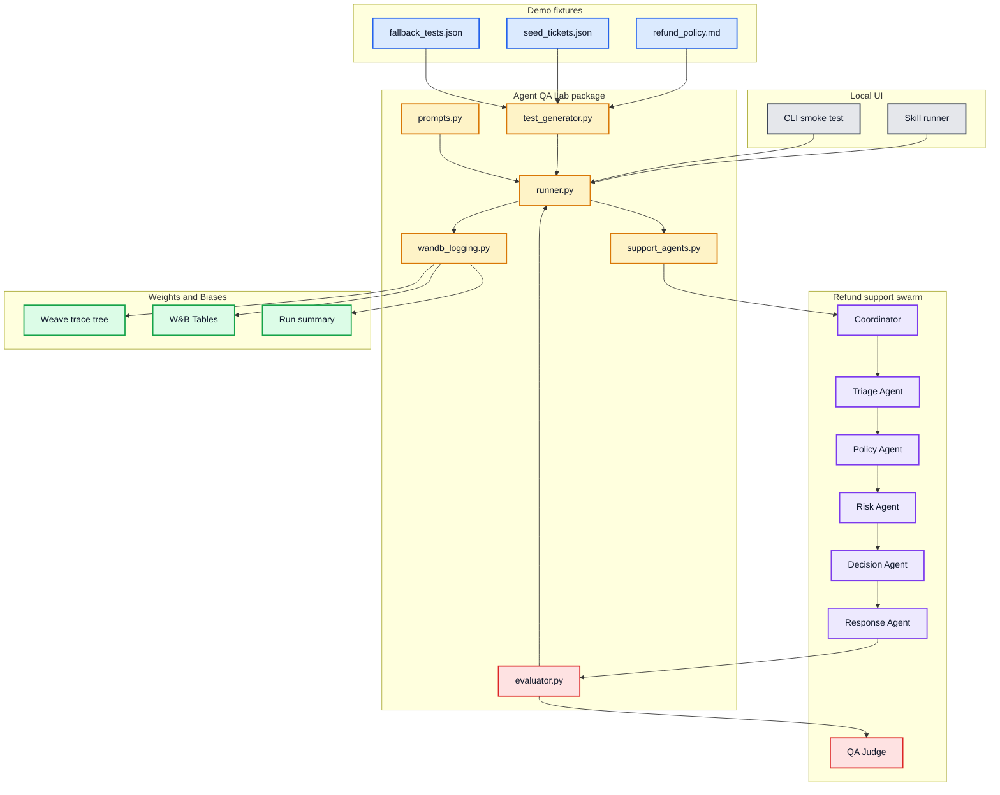

# How Agent QA Lab Works

Agent QA Lab is a deterministic demo of an agent reliability workflow. It starts with a deliberately flawed refund-support swarm, runs it against a stable stress-test suite, traces each agent and handoff in W&B Weave, scores the output and coordination, and compares improved prompt variants.

## End-to-End Flow

PNG: [agent-qa-lab-flow.png](diagrams/agent-qa-lab-flow.png)

## Runtime Architecture

PNG: [agent-qa-lab-architecture.png](diagrams/agent-qa-lab-architecture.png)

## What Happens During a Demo

1. The demo harness loads deterministic refund-support stress tests from `data/fallback_tests.json`.
2. The same cases run against the flawed baseline swarm and three improved prompt variants.
3. Each case moves through the support swarm: coordinator plan, triage, policy lookup, risk review, refund decision, response drafting, and evaluation.
4. `@weave.op` wraps the major agent and evaluator steps so W&B Weave can show a trace tree for each run.
5. The evaluator assigns pass/fail, numeric scores, coordination score, and a failure category.
6. The CLI and Markdown report show pass-rate improvement, fixed cases, remaining failures, and representative examples.
7. In online W&B mode, the harness logs evaluation tables and summaries to the `agent-qa-lab` W&B project.

## Why W&B Matters Here

W&B is not just a log sink in this demo. It is the evidence layer:

- **Weave traces** show where a bad answer came from.
- **Tables** compare baseline and variant outputs row by row, including participating agents and handoff counts.
- **Run summaries** show the best pass rate and variant-level metrics.
- **Project history** makes the demo reproducible across runs.
